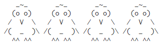

# Penguins with print in Python
Drawing penguins with the help of print function in Python

### Reference to:
[1] Valentyn N Sichkar. Drawing penguins with the help of print function in Python // GitHub platform [Electronic resource]. URL: https://github.com/sichkar-valentyn/Penguins_with_print_in_Python (date of access: XX.XX.XXXX)

## Description
With the help of _print_ function in Python drawing Penguins in one line.
 

 

## MIT License
## Copyright (c) 2018 Valentyn N Sichkar
## github.com/sichkar-valentyn
### Reference to:
[1] Valentyn N Sichkar. Drawing penguins with the help of print function in Python // GitHub platform [Electronic resource]. URL: https://github.com/sichkar-valentyn/Penguins_with_print_in_Python (date of access: XX.XX.XXXX)
